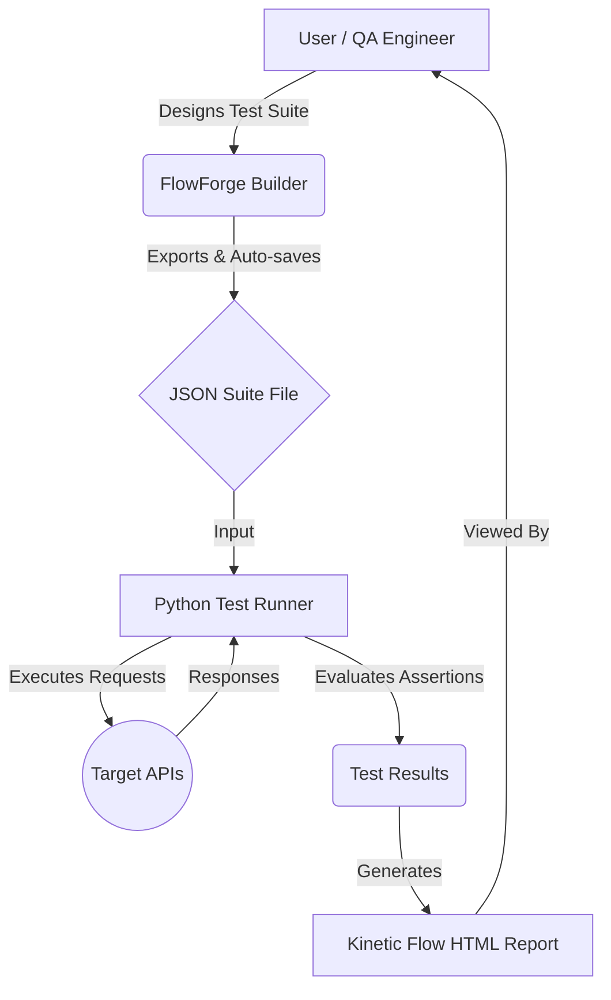

# FlowForge & Python API Automation Framework

FlowForge is a visual API Test Suite Builder paired with a robust Python automation framework. It allows you to **visually design** API tests, configure environments, map dependencies between requests, and execute them to generate beautiful standalone HTML reports.

 <!-- Replace with actual screenshot path -->


## Core Features

- **Visual Suite Builder (FlowForge)**: No-code interface to design API tests. Supports standard HTTP methods, customizable headers, variable extraction, JSON/form payloads, and assertions.
- **cURL Import**: Instantly convert cURL commands from your browser into test cases.
- **Variable Dependencies**: Extract data from one response (e.g., Auth Tokens) and inject them into subsequent requests using `{{variable}}` syntax.
- **Performance & Reliability Metrics**: Track success rates, min/max/average response times, and p95 thresholds natively.
- **Beautiful Kinetic Flow Reports**: The runner outputs detailed, standalone HTML reports complete with assertions evidence and network timings matching the UI design system.

---

## 🏗️ Architecture & Workflow



---

## 🚀 Quick Start

### 1. Visually Design the API Test

1. Navigate to the `suite_builder/` folder.
2. Open `suite_builder.html` in your web browser (or serve it via a local python server).
3. Use the interface to define your endpoints, environments, payloads, and assertions.
4. Export the resulting JSON file into the `suites/` folder (e.g., `suites/my_test_suite.json`).

*Pro tip: The builder auto-saves your progress in your browser. You can safely soft-refresh without losing your draft suite. To start fresh, click the "Reset Flow" button.*

### 2. Run the Suite

Open a terminal in the root folder of this project:

```bash
# Run the Python test executor
python3 run_api_tests.py --suite suites/my_test_suite.json --out reports
```

### 3. View the Results

The CLI will print the path to the newly generated report:
```text
HTML report generated: /path/to/project/reports/api_report_YYYYMMDD_HHMMSS.html
API checks passed: X of Y cases passed.
```
Open this HTML file in your browser to view the detailed results.

 <!-- Replace with actual screenshot path -->

---

## 🧪 Converting to JMeter (JMX)

You can convert any exported JSON test suite into a JMeter-compatible `.jmx` file using the conversion tool. This lets you seamlessly transition from visual regression/functional checks to load testing in Apache JMeter.

### Run the Converter

```bash
python3 json_to_jmx.py suites/my_test_suite.json -o suites/my_test_suite.jmx
```

*Note: If `-o`/`--output` is omitted, the script automatically generates a JMX file in the same directory with a `.jmx` extension.*

### Supported Mapping Logic

- **Placeholder Conversion**: Translates `{{variable}}` to JMeter `${variable}` and `{{env.VAR_NAME}}` to `${__groovy(System.getenv('VAR_NAME'))}` for runtime environment access.
- **Request Body & Payloads**: Fully maps raw JSON, form data, and multipart/file-upload fields (including automated MIME type guessing).
- **Assertions**: Converts all framework assertions (status code, headers, duration SLA, body match, JSON paths, and JSON datatypes) into native JMeter assertions (or JSR223 Groovy assertions for complex logic).
- **Listeners & Setup**: Injects default variables, a cookie manager, a header manager, and a pre-configured **View Results Tree** listener for immediate GUI debugging.

---

## 📋 Assertions Engine

FlowForge and the Python runner support a wide array of built-in assertions:

| Assertion | Purpose |
| --- | --- |
| `status_code` | Validates HTTP status code (e.g., `200`, `201`). |
| `response_time_under_ms` | Validates request performance against SLA thresholds. |
| `header_contains` | Checks if a specific string exists within a header. |
| `body_contains` | Raw substring check on the response body text. |
| `json_path_exists` | Checks if a JSON path exists (e.g., `$.data.id`). |
| `json_path_equals` | Validates the exact value of a JSON path. |
| `json_path_contains` | Checks if a JSON path string contains expected text. |
| `json_path_type` | Validates structural types (`string`, `integer`, `boolean`, `array`, `object`). |

---

## 📂 Project Layout

```text
.
├── suite_builder/       # FlowForge Visual GUI (HTML/JS/CSS)
├── apitester/           # Core Python engine
│   ├── assertions.py    # Assertion evaluation & JSONPath processing
│   ├── client.py        # Native HTTP client
│   ├── metrics.py       # Math and timing aggregations
│   ├── report.py        # HTML Report renderer (Kinetic Flow template)
│   └── runner.py        # CLI orchestration
├── suites/              # Saved JSON Test Suites go here
├── reports/             # Generated HTML execution reports
├── run_api_tests.py     # Main CLI entrypoint
├── json_to_jmx.py       # JMX converter script
└── .gitignore
```
